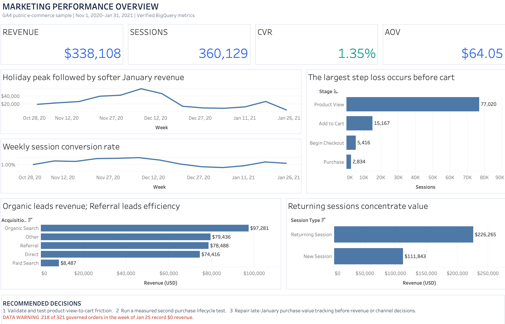
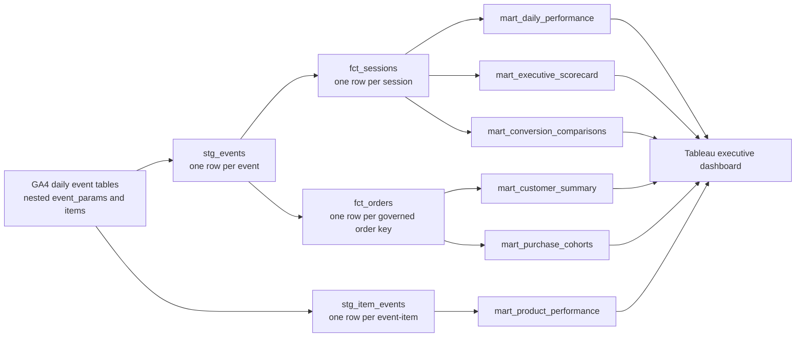

# E-Commerce Customer Journey & Marketing Performance Analytics

An end-to-end marketing BI portfolio project built around the official Google Analytics 4 (GA4) obfuscated e-commerce sample for the Google Merchandise Store. The project turns nested event-level clickstream data into documented, quality-checked BigQuery reporting marts designed for an executive Tableau dashboard.

> **Verified build:** BigQuery project `e-commerce-marketing-bi`, 2026-08-18. All ten blocking data-quality checks passed, and the packaged workbook was opened and rendered in Tableau Desktop 2026.2.

## Business problem

Marketing and merchandising leaders lack a unified view of how acquired users progress from sessions to product views, carts, checkout, purchase, and repeat purchase. This project creates a governed reporting layer that answers where conversion is lost, which acquisition channels and devices contribute revenue, and which products and customer groups warrant action.

## Results at a glance

| KPI | Full sample |
|---|---:|
| Sessions | 360,129 |
| Pseudonymous users | 270,154 |
| Purchase sessions | 4,848 |
| Governed orders | 5,279 |
| Purchase revenue | $338,108 |
| Session conversion | 1.35% |
| Average order value | $64.05 |
| Observed repeat-purchase rate | 11.77% |

### Executive findings

1. **Returning sessions concentrate value:** 27.5% of sessions generated 66.9% of revenue and converted 4.553× as often as new sessions; the approximate conversion-difference interval was +2.308 to +2.534 percentage points.
2. **The largest ordered funnel loss occurs before cart:** 19.69% of product-view sessions recorded a later add-to-cart event; 35.71% then reached checkout and 52.33% then purchased.
3. **Referral outperformed Paid Search on observed efficiency:** conversion was 1.66% versus 0.98%, with an approximate difference interval of +0.499 to +0.866 percentage points. Spend and incrementality are unavailable, so this is not a budget-allocation claim.
4. **Late-January revenue is not decision-grade:** 218 of 321 governed orders in the final week have zero recorded revenue.

Full definitions and reproducible query context: [`docs/verified_results.md`](docs/verified_results.md). Statistical method and caveats: [`docs/statistical_analysis.md`](docs/statistical_analysis.md).

## Tableau executive dashboard

[Open the packaged Tableau workbook](tableau/Ecommerce_Marketing_Executive_Dashboard.twbx). It contains ten native worksheets and one fixed 1,300 × 850 executive dashboard, with five governed CSV sources packaged locally for portability. The implemented view includes four KPI cards, weekly revenue and conversion trends, a session funnel, acquisition-channel performance, a new-versus-returning session comparison, and executive recommendations.



## Technology stack

- **BigQuery GoogleSQL:** nested GA4 extraction, session/order facts, reusable marts, validation, and approximate statistical comparisons
- **Tableau Desktop 2026.2:** native packaged workbook with executive KPIs, trends, funnel, channel, and customer-segment views
- **Python:** extract reconciliation and reproducible Tableau-workbook generation
- **Shell:** parameterized BigQuery build runner with a 25 GB per-query safety cap

## Stakeholder questions

1. How many users and sessions did the store attract, and how did traffic change over time?
2. Where is the largest loss in the session funnel from product view through purchase?
3. Which first-user acquisition channels produce the most revenue and the strongest conversion rate?
4. How do desktop, mobile, and tablet experiences differ in engagement and purchase conversion?
5. Which products and categories lead product interest, cart activity, purchases, and item revenue?
6. What share of purchasers buy again within the observed window, and how quickly?
7. How do new and returning sessions differ in conversion and average order value?
8. Which period-over-period changes are large enough to require marketing or merchandising follow-up?

## Dataset

- **Source:** `bigquery-public-data.ga4_obfuscated_sample_ecommerce.events_*`
- **Owner/publisher:** Google, through the BigQuery Public Datasets program
- **Coverage:** 2020-11-01 through 2021-01-31
- **Grain:** one row per GA4 event, with repeated `event_params` and `items` records
- **Access:** a Google Cloud project with BigQuery enabled; BigQuery Sandbox or the free usage tier is sufficient for exploration
- **Official documentation:** [GA4 e-commerce sample](https://developers.google.com/analytics/bigquery/web-ecommerce-demo-dataset), [GA4 BigQuery export schema](https://support.google.com/analytics/answer/7029846), [BigQuery public datasets](https://cloud.google.com/bigquery/public-data)

Google states that this dataset is obfuscated and may have limited internal consistency. It emulates a real-world Google Merchandise Store implementation; placeholder values and tracking anomalies are treated as data-quality findings, not silently repaired.

## Architecture



## Repository structure

```text
.
├── README.md
├── CASE_STUDY.md
├── docs/
│   ├── business_context.md
│   ├── data_dictionary.md
│   ├── data_model.md
│   ├── dashboard_spec.md
│   ├── kpi_definitions.md
│   ├── limitations.md
│   └── verified_results.md
├── sql/
│   ├── 00_setup/
│   ├── 01_profiling/
│   ├── 10_staging/
│   ├── 20_core/
│   ├── 30_marts/
│   ├── 50_statistics/
│   ├── 90_validation/
│   └── 99_exports/
├── scripts/
├── tableau/
├── exports/              # small, verified Tableau-ready CSVs
└── data/
```

## Quick start

Prerequisites for a fresh warehouse build: a Google Cloud project, BigQuery enabled, and either the Cloud Console or the `bq` CLI. Tableau Desktop or Tableau Public is needed only to open or modify the included workbook.

Detailed instructions: [`docs/setup.md`](docs/setup.md). Source and attribution details: [`docs/source_attribution.md`](docs/source_attribution.md).

1. Replace every `YOUR_PROJECT_ID` placeholder in `sql/` with the billing/project ID that will own the derived tables.
2. Run the SQL files in numeric order using BigQuery GoogleSQL.
3. Confirm every `ERROR` row in `marketing_analytics.dq_results` has `status = 'PASS'`; investigate and disclose `WARN` rows.
4. Compare the result to `docs/verified_results.md`.
5. Export the dashboard tables using `sql/99_exports/99_tableau_exports.sql`, or use the included governed extracts.
6. Rebuild the packaged workbook with `python3 scripts/build_tableau_workbook.py` if needed.
7. Open `tableau/Ecommerce_Marketing_Executive_Dashboard.twbx` in Tableau Desktop/Public. Use `docs/dashboard_spec.md` for the direct-BigQuery, globally filterable enhancement.

CLI execution example:

```bash
./scripts/run_bigquery.sh YOUR_PROJECT_ID
```

The runner validates the project ID, stops on the first failed query, and caps each query at 25 GB billed bytes. The verified warehouse run used the BigQuery Cloud Console; the shell runner has passed syntax validation.

Run repository-only checks at any time with `python3 scripts/preflight.py`. Preflight does not substitute for BigQuery execution.

## Supporting documentation

- [`CASE_STUDY.md`](CASE_STUDY.md)
- [`docs/sql_concepts_demonstrated.md`](docs/sql_concepts_demonstrated.md)
- [`docs/performance_notes.md`](docs/performance_notes.md)

## Implemented scope

- Source profiling and documented assumptions
- Event, item, session, and order models
- Executive, funnel, trend, channel, device, product, customer, and cohort metrics
- Automated data-quality results and reconciliation checks
- Flat Tableau marts, governed extracts, and a native packaged executive dashboard
- Verified findings, Tableau dashboard, dashboard specification, and case study

## Future enhancements

- BigQuery ML purchase-propensity model with explicit holdout evaluation
- RFM/customer clustering
- Forecasting with explicit holdout evaluation
- Scheduled BigQuery queries and automated extract refresh
- Validated date partitioning and clustering in a production-capable BigQuery environment
- Power BI, Looker Studio, or Qlik version of the executive dashboard

## Limitations

The included workbook is a portable, full-window executive view built from five aggregate CSV snapshots. Direct BigQuery connectivity is required for global date, channel, device, geography, and session-type filters. The source contains no media spend, margin, authenticated identity, or experimental assignment, so the analysis does not estimate ROAS, profit, cross-device customers, or causal lift. See [`docs/limitations.md`](docs/limitations.md) for the complete interpretation boundary.

## License

Original SQL, scripts, and documentation are available under the [MIT License](LICENSE). The underlying GA4 sample remains subject to Google's terms and is not redistributed here.
